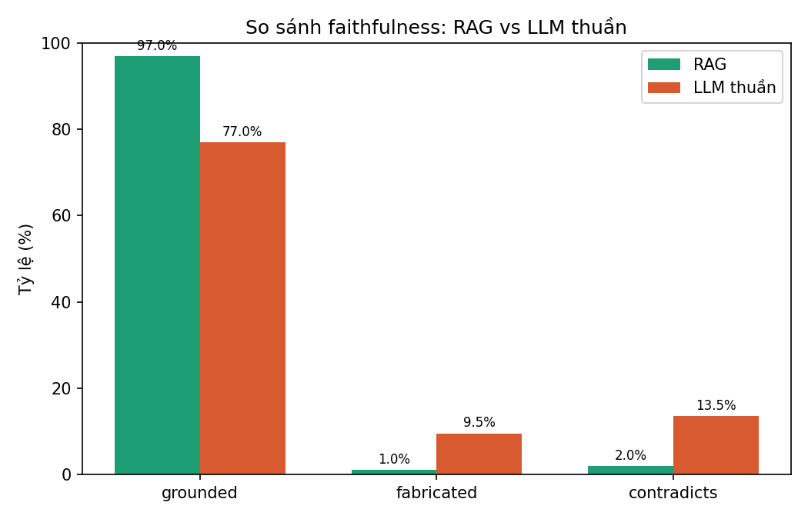

# Đánh giá faithfulness

- Judge model: `Qwen/Qwen2.5-3B-Instruct`
- Context RAG: retrieved support thực tế được đưa vào prompt
- Số câu đã chấm: 400 (mỗi câu gồm cả RAG và LLM thuần)

| Phương pháp | grounded (%) | fabricated (%) | contradicts (%) | Tổng câu |
|---|---:|---:|---:|---:|
| RAG | 97.0 | 1.0 | 2.0 | 200 |
| LLM thuần | 77.0 | 9.5 | 13.5 | 200 |

Chi tiết từng câu (gồm câu hỏi, câu trả lời và lý do của judge) nằm trong `faithfulness_judgments.csv` và `faithfulness_judgments.json`.
